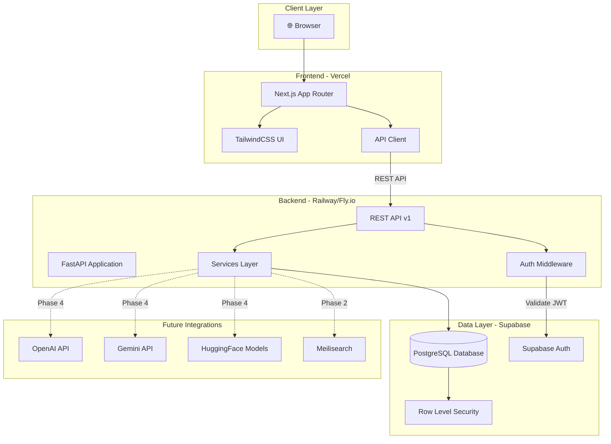
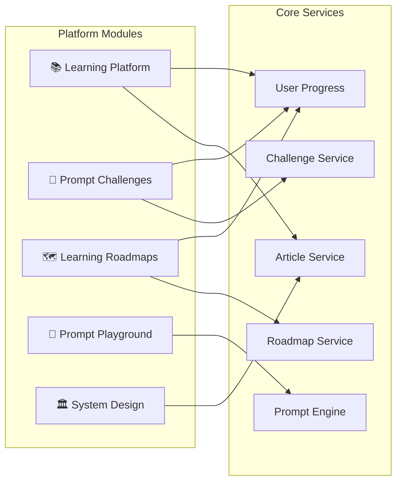
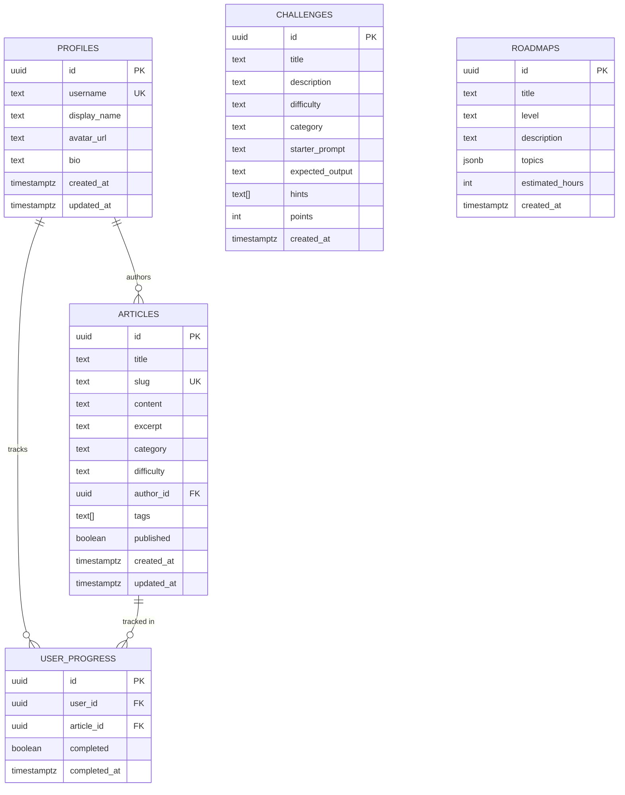
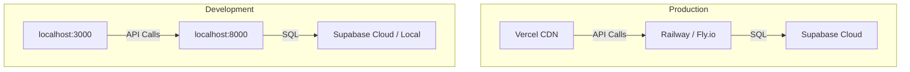

# 🏗️ Prompt Dairy — Architecture Document

## System Overview

Prompt Dairy is a full-stack learning platform for Prompt Engineering and AI System Design. The platform follows a **decoupled architecture** with separate frontend and backend services communicating via REST APIs.

---

## High-Level Architecture

---

## Module Architecture

---

## Database Schema (ERD)

---

## API Architecture

### Base URL: `/api/v1`

| Endpoint | Method | Auth | Description |
|----------|--------|------|-------------|
| `/articles` | GET | No | List published articles |
| `/articles/{id}` | GET | No | Get article detail |
| `/challenges` | GET | No | List challenges |
| `/roadmaps` | GET | No | List roadmaps |
| `/auth/signup` | POST | No | Register new user |
| `/auth/login` | POST | No | Login user |
| `/user/progress` | GET | Yes | Get user progress |
| `/user/progress` | POST | Yes | Update progress |

### Future Endpoints (Phase 4+)
| Endpoint | Method | Auth | Description |
|----------|--------|------|-------------|
| `/playground/run` | POST | Yes | Execute prompt |
| `/playground/models` | GET | No | List available models |

---

## Security Architecture

1. **Authentication**: Supabase Auth handles user registration & login
2. **Authorization**: JWT tokens validated on every protected request
3. **Database Security**: Row-Level Security (RLS) policies on all tables
4. **API Security**: CORS configured, rate limiting (future)
5. **Secrets Management**: Environment variables, never committed to Git

---

## Deployment Architecture

---

## Development Phases

| Phase | Scope | Timeline |
|-------|-------|----------|
| **Phase 1** | Platform Setup (repo, backend, frontend, DB) | Week 1 |
| **Phase 2** | Core Learning Platform (articles, search) | Week 2 |
| **Phase 3** | Practice System (challenges, progress) | Week 3 |
| **Phase 4** | Prompt Playground | Week 4 |
| **Phase 5** | Beta Launch & Deployment | Week 4+ |
